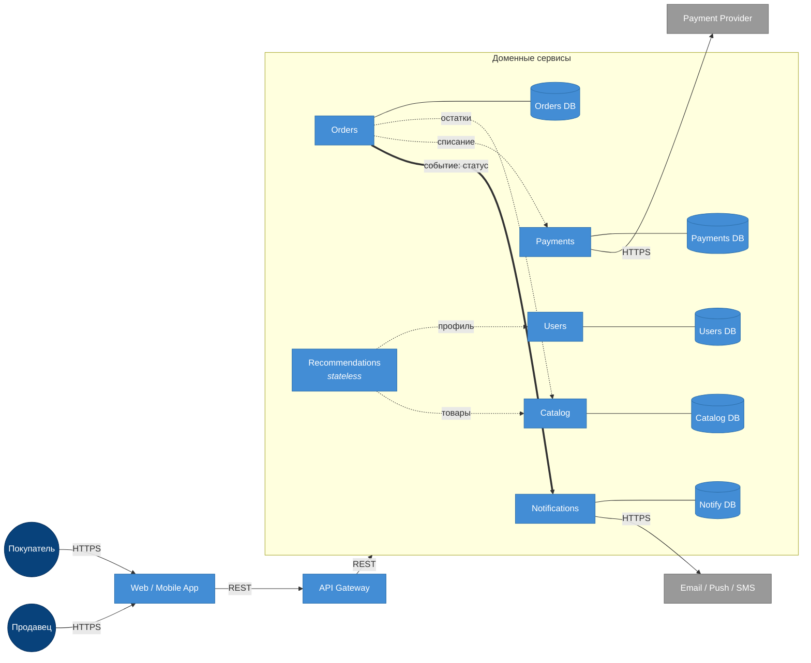

# ДЗ-1. Маркетплейс: C4 + сервис в Docker

## C4 Container

Сплошные тонкие стрелки — основной поток запроса и интеграции с внешними системами (HTTPS). Пунктирные с подписями — синхронные REST-вызовы между сервисами. Толстая стрелка `Orders → Notifications` — асинхронное событие (через шину/очередь).




## Домены и ответственности

ТЗ задаёт шесть функций, но за каждой стоит несколько разных предметных областей. На уровне DDD выделено 11 бизнес-доменов:

| Домен | Ответственность |
|---|---|
| Identity & Auth | Регистрация, логин, пароли, сессии и токены, MFA, проверка прав доступа |
| Users | Профили покупателей: имя, контакты, адреса доставки |
| Sellers | Профили продавцов, верификация (KYC), банковские реквизиты, настройки магазина |
| Catalog | Карточки товаров, категории, описания, медиа, цены |
| Inventory | Остатки на складе, резервирование под заказ |
| Cart | Корзина пользователя до оформления заказа |
| Orders | Оформление заказа и жизненный цикл статусов (`new → paid → shipped → delivered → cancelled`) |
| Payments | Приём платежей от покупателей, отмены и возвраты (refunds) |
| Payouts | Расчёт и перечисление денег продавцам |
| Recommendations | Сборка персональной ленты товаров для пользователя |
| Notifications | Шаблоны и доставка сообщений по Email / Push / SMS |

## Распределение доменов по сервисам

Соседние домены сгруппированы в один сервис, если у них общая модель данных и тесная транзакционная связь. Различия в нагрузочном профиле или контуре безопасности — повод выносить в отдельный сервис. Так получилось 6 доменных сервисов:

| Сервис | Какие домены | Логика группировки |
|---|---|---|
| Users | Identity & Auth + Users + Sellers | Все три крутятся вокруг сущности «пользователь». Креды и PII живут в одном защищённом контуре; продавец — тот же пользователь с расширенным профилем. Дробить дальше имеет смысл при появлении внешнего IdP (OIDC) или отдельной KYC-команды |
| Catalog | Catalog + Inventory | Каталог и остатки нужны вместе при любом запросе товара; владелец один — продавец. Inventory можно выделить позже, если резервы станут горячей транзакционной точкой |
| Orders | Cart + Orders | Корзина — пре-стадия заказа; данные постепенно превращаются в позиции заказа. В одном сервисе проще удержать согласованность «корзина → черновик → заказ» |
| Payments | Payments + Payouts | Оба про деньги, оба общаются с внешним PSP, одинаковые требования к PCI/аудиту |
| Recommendations | Recommendations | Stateless-агрегатор: своих сущностей нет, читает Users + Catalog |
| Notifications | Notifications | Изолирован от бизнес-потока, чтобы тормоза внешних провайдеров не аффектили заказы |

API Gateway — общая точка входа клиента, проксирует запросы в нужный сервис; собственных доменных данных не хранит.

## Границы владения данными

| Сервис | Чем владеет (своя БД) | Откуда читает чужие данные |
|---|---|---|
| Users | креды, токены/сессии, профили покупателей, профили продавцов и KYC | — |
| Catalog | товары, категории, цены, остатки, резервы | — |
| Recommendations | — (stateless) | Users (профиль), Catalog (товары) — sync REST |
| Orders | корзины, заказы, позиции, статусы, история переходов | Catalog (цена и остатки), Payments (статус платежа) — sync REST |
| Payments | платежные намерения, транзакции, возвраты, выплатные ведомости | внешний PSP — sync HTTPS |
| Notifications | история отправок, шаблоны сообщений | внешние провайдеры email/push/SMS — sync HTTPS |

Правила:

- У каждого сервиса **своя БД**. Между сервисами нет ни общих таблиц, ни общих схем — никаких разделяемых БД.
- К чужим данным сервис ходит **только через REST API** соответствующего владельца домена.
- При оформлении заказа Orders не копирует каталог: сохраняет `product_id` и цену на момент покупки (snapshot).

## Взаимодействия сервисов

| Откуда | Куда | Тип | Что передаёт |
|---|---|---|---|
| Web / Mobile | API Gateway | sync REST (HTTPS) | пользовательские запросы |
| API Gateway | любой доменный сервис | sync REST | проксирование |
| Recommendations | Users | sync REST | профиль пользователя |
| Recommendations | Catalog | sync REST | данные товаров для ленты |
| Orders | Catalog | sync REST | проверка/резерв остатков и цены |
| Orders | Payments | sync REST | списание средств |
| **Orders** | **Notifications** | **async event** | факт смены статуса заказа |
| Payments | Payment Provider | sync HTTPS | проведение платежа |
| Notifications | Email / Push / SMS | sync HTTPS | отправка сообщения |

Все «деловые» межсервисные вызовы — синхронный REST: при оформлении заказа нужны подтверждение остатка от Catalog и успех платежа от Payments прямо в рамках запроса. **Уведомления (Orders → Notifications)** вынесены в асинхронный канал (событие через шину/очередь): отправка email/push не должна блокировать оформление заказа и не должна откатывать его при сбое внешнего провайдера. Если Notifications упадёт, заказ всё равно создастся, а сообщение уйдёт позже (retry).

## Запуск

Требования: Docker и Docker Compose.

```bash
cd hw-1
docker compose up --build -d
```

Проверка `/health`:

```bash
curl -i http://localhost:8080/health
```

Ожидаемый ответ:

```
HTTP/1.1 200 OK
content-type: application/json

{"status":"ok"}
```

Остановить:

```bash
docker compose down
```
