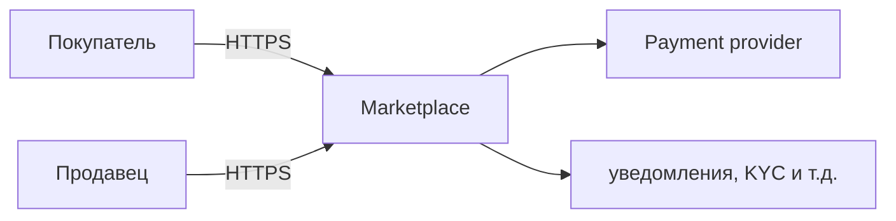
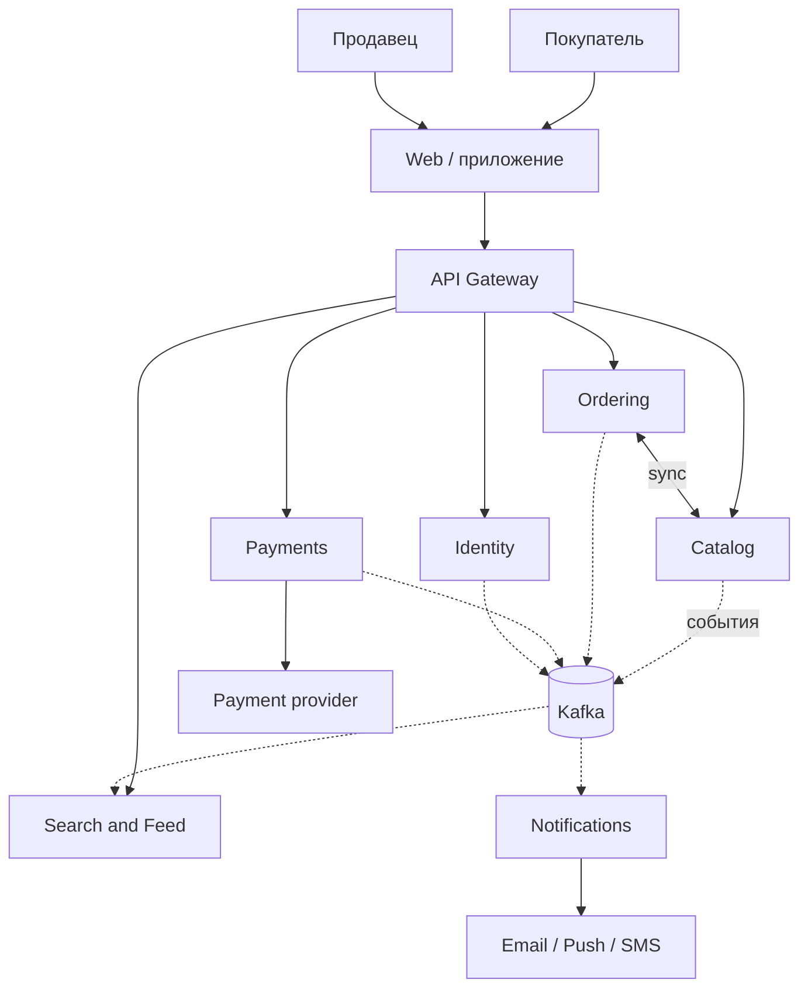

# ДЗ-1. Маркетплейс: архитектура (C4) + сервис в Docker

Задание: продумать архитектуру маркетплейса, нарисовать **C4 уровень Container**, поднять **один** сервис в Docker с **`GET /health` → 200 OK**. Логику бизнеса не пишем — только описание и заглушка сервиса.

## Что должна уметь система (из ТЗ)

| Функция | Кратко |
|---|-----|
| Персонализированная лента | главная под пользователя |
| Каталог | продавцы ведут товары и остатки |
| Пользователи | покупатели и продавцы, авторизация, профиль |
| Заказы | корзина, оформление, статусы |
| Платежи и учёт | списание, выплаты продавцам, возвраты |
| Уведомления | письма/пуши/SMS про заказ |

## Домены (bounded context)

| Домен | За что отвечает |
|-------|----------------|
| Identity & Access | пользователи, вход, роли, KYC продавца |
| Catalog | товары, категории, цены, остатки |
| Search & Feed | поиск, лента (здесь и персонализация) |
| Ordering | корзина, заказ, статусы |
| Payments | платежи, выплаты, возвраты |
| Notifications | отправка уведомлений по событиям |

Считаю правилом: **у каждого сервиса своя база**, общих БД между сервисами нет. Данные другого домена нужны только через его API или события из шины.

## Варианты разнесения системы

**A. Один большой монолит** — все модули в одном деплое, одна (или несколько схем в одной) БД.

- Плюсы: проще разрабатывать и деплоить в начале, проще транзакции внутри.
- Минусы: один репозиторий нагрузки на всё приложение; платежная зона смешивается с остальным кодом.

**B. Несколько сервисов по доменам** — ниже именно это взял основой (Gateway + сервисы из таблицы + Kafka).

- Плюсы: можно масштабировать и выкладывать отдельные части; платежи и персональные данные можно изолировать.
- Минусы: нужна шина/саги там, где раньше хватило одной транзакции; мониторинг и отладка сложнее.

**C. Отдельно read-домены (CQRS-lite)** — много сервисов только на чтение (лента/поиск) и отдельно на запись.

- Плюсы: очень хорошо под очень высокое чтение.
- Минусы: получается слишком много частей для учебной работы; задержки между записью и чтением.

**Итог:** выбрал **вариант B** — домены из таблицы выше мапятся на отдельные сервисы. Для большого маркетплейса это нормальный компромисс: не как у гиганта с десятками сервисов, но и не один монолит. Вариант A оставался бы разумным сильно маленьком продукте; C — когда реально упираются в чтение.

## C4 Context (набросок в Mermaid)



PlantUML этого уровня: [`diagrams/c4-context.puml`](diagrams/c4-context.puml).

## C4 Container (основная диаграмма для ДЗ)



Пунктир — асинхронно через Kafka, сплошные линии — синхронные вызовы (через gateway или напрямую между сервисами где нужен быстрый ответ).

Исходник для сдачи в нотации C4-PlantUML: [`diagrams/c4-container.puml`](diagrams/c4-container.puml).

## Домены → сервисы и базы своих доменов

| Сервис | Домен | Данные (владеет) |
|--------|-------|-------------------|
| API Gateway | — | без своей БД |
| Identity | Identity & Access | пользователи, сессии, профиль продавца |
| Catalog | Catalog | товары, SKU, остатки, цены |
| Search & Feed | Search & Feed | индекс поиска, события/фичи для ленты |
| Ordering | Ordering | корзина, заказы, позиции |
| Payments | Payments | платежи, транзакции, выплаты |
| Notifications | Notifications | отправки, шаблоны |

Между сервисами: **REST/gRPC для запросов “сейчас”**, и **сообщения в Kafka**, когда нужно разослать событие нескольким подписчикам (лента обновилась, заказ создан, платёж прошёл — уведомления и т.д.).

Пример синхронного: Ordering при оформлении спрашивает Catalog про остаток. Пример асинхронного: Catalog публикует изменение товара, Feed себе обновляет индекс.

| Откуда | Куда | Sync / Async | Зачем |
|-----|-----|-----|-------|
| Gateway | Identity, Catalog, Feed, Ordering, Payments | sync | запрос пользователя из приложения |
| Ordering | Catalog | sync | резерв остатка |
| многие сервисы | Kafka | async | доменные события на разных получателей |
| Payments | внешний PSP | sync | платёж |
| Notifications | провайдеры | sync | отправка письма или пуша |

## Сервис в Docker

Поднял **API Gateway** на FastAPI: на диаграмме это входная точка, код минимальный. Есть **`GET /health`** (возвращает JSON и код 200), остальное — заглушка.

Код: [`services/api-gateway/`](services/api-gateway/).

## Как запустить

Из папки `hw-1`:

```bash
docker compose up --build -d
curl -i http://localhost:8080/health
```

Остановить: `docker compose down`.

Локально без Docker:

```bash
cd services/api-gateway
python -m venv .venv
source .venv/bin/activate   # Windows: .venv\Scripts\activate
pip install -r requirements.txt
uvicorn app.main:app --host 0.0.0.0 --port 8080
```

## Структура папки

```
hw-1/
├── README.md
├── docker-compose.yml
├── diagrams/
│   ├── c4-context.puml
│   └── c4-container.puml
└── services/api-gateway/
    ├── Dockerfile
    ├── requirements.txt
    └── app/main.py
```
