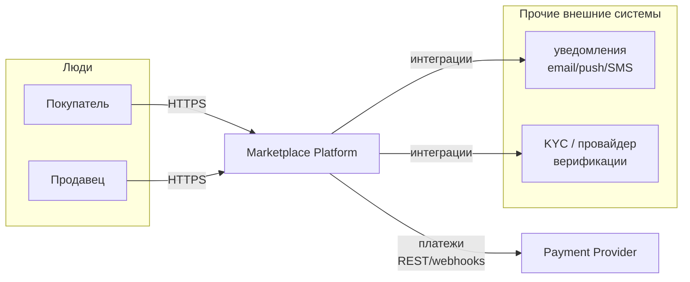
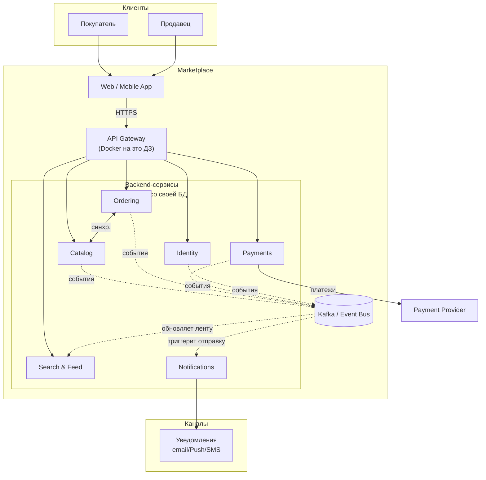

# ДЗ-1. Архитектура маркетплейса (C4 + первый сервис в Docker)

> Курс: «Сервис-ориентированные архитектуры», НИУ ВШЭ.
> Цель: спроектировать архитектуру цифрового маркетплейса, зафиксировать её
> на C4-диаграмме уровня Container и поднять один сервис в Docker
> с health-check эндпоинтом. Бизнес-логику не реализуем — задача архитектурная.

---

## 1. Контекст и требования

Маркетплейс — двусторонняя платформа: **продавцы** размещают товары,
**покупатели** оформляют заказы. Платформа должна обеспечивать:

| # | Capability | Краткое описание |
|---|------------|------------------|
| 1 | Персонализированная лента товаров | Главная страница и подборки выдаются с учётом интересов пользователя. |
| 2 | Управление каталогом | Продавцы создают, редактируют, снимают с продажи товары, управляют остатками и ценами. |
| 3 | Управление пользователями | Регистрация и аутентификация покупателей и продавцов, профили, KYC продавца. |
| 4 | Оформление заказов | Корзина, оформление, расчёт стоимости, резервирование остатка, статусы. |
| 5 | Расчёт и учёт платежей | Авторизация платежа покупателя, расщепление выплат продавцам, возвраты. |
| 6 | Уведомления о статусах | Email/Push/SMS о ключевых событиях заказа. |

**Нефункциональные ожидания** (используем как фильтр при выборе варианта):

- *Read-heavy*: лента и каталог читаются на порядки чаще, чем пишутся.
- *Пиковая нагрузка*: распродажи → нужны независимое горизонтальное
  масштабирование чтения каталога/ленты и буферизация заказов.
- *Команды растут независимо*: каталог, заказы, платежи, рекомендации
  развиваются разными командами.
- *Регуляторные требования*: платежи и персональные данные изолированы.
- *Доступность* важнее строгой консистентности для ленты и каталога;
  для платежей наоборот.

> На этом этапе бизнес-логика не реализуется — это эскиз архитектуры.

---

## 2. Домены и их ответственность

Выделил bounded-context'ы из требований по DDD-логике (один контекст —
один владелец данных, один язык предметной области).

| Домен | Зона ответственности | Ключевые сущности |
|---|---|---|
| **Identity & Access** | Регистрация, логин, токены, профиль, роли (buyer/seller), 2FA, KYC продавцов. | `user`, `credentials`, `seller_profile`, `session` |
| **Catalog** | Карточки товаров, категории, атрибуты, остатки и цены, модерация. | `product`, `sku`, `category`, `inventory`, `price` |
| **Search & Feed** | Полнотекстовый поиск, фасеты, персональная лента, ранжирование, история показов/кликов. | `feed_item`, `user_event`, `ranking_features`, `search_index` |
| **Ordering** | Корзина, чекаут, оркестрация оформления, жизненный цикл заказа, статусы. | `cart`, `order`, `order_item`, `order_status` |
| **Payments & Billing** | Авторизация платежей, расщепление выплат продавцам, возвраты, выписки. | `payment`, `transaction`, `payout`, `refund` |
| **Notifications** | Доставка сообщений (email/push/SMS), шаблоны, подписки, retry. | `notification`, `template`, `delivery_attempt` |

Принципы выделения:

1. **Один домен — одна команда — одна БД.** Никаких shared schemas.
2. **Внутри домена** допускается совместное хранилище нескольких
   близких сущностей (например, `product` и `inventory` в Catalog).
3. **Между доменами** общение только через публичный API домена
   (sync REST/gRPC) или через события (async, шина).

---

## 3. Альтернативные варианты декомпозиции

Рассматриваю **три** существенно отличающихся варианта. Trade-off'ы
сравниваю относительно нефункциональных ожиданий из §1.

### Вариант A. Модульный монолит

Один деплоймент, внутри — модули `identity`, `catalog`, `ordering`,
`payments`, `feed`, `notifications`, общая транзакционная БД с разными
схемами.

**Плюсы**
- Минимальный operational overhead: один артефакт, одна БД, один CI/CD.
- Кросс-доменные операции через ACID-транзакции — не нужны саги.
- Самый дешёвый старт: подходит небольшой команде на ранней стадии.
- Простой дебаг, единый стектрейс, никаких сетевых отказов между модулями.

**Минусы**
- Любое масштабирование — целиком: всплеск чтения ленты тянет за собой
  деплой биллинга.
- Регуляторика: PCI-scope расползается на всё приложение.
- Релизный поезд: команды блокируют друг друга, выкатка раз в день/неделю.
- Технологическая монокультура: одна БД, один рантайм, один язык.
- Нет четких границ владения данными — соблазн читать чужие таблицы.

### Вариант B. Микросервисы по бизнес-доменам *(финальный выбор)*

Шесть сервисов 1-в-1 на домены из §2: Identity, Catalog, Search & Feed,
Ordering, Payments, Notifications. Снаружи — API Gateway. Между
сервисами — REST/gRPC для синхронных запросов и шина событий (Kafka)
для асинхронной коммуникации. У каждого сервиса своя БД.

**Плюсы**
- Чёткие границы владения данными, нет shared DB.
- Независимое масштабирование: read-heavy Catalog/Feed горизонтально,
  Payments/Ordering — по транзакционной нагрузке.
- Независимый деплой и tech-stack по сервисам.
- PCI-scope локализован в Payments.
- События дают «бесплатную» интеграцию: подписался на `order.paid` —
  работаешь.

**Минусы**
- Распределённые транзакции → саги, eventual consistency.
- Operational complexity: 6 сервисов, наблюдаемость, трассировка, шина.
- Сетевые отказы, ретраи, идемпотентность — must-have, а не nice-to-have.
- Дороже на старте, чем монолит.

### Вариант C. CQRS / Read–Write split

Жёстко разделяем команды по типу нагрузки: отдельные сервисы под
запись (`catalog-write`, `order-write`, `payment-write`) и отдельные
под чтение (`catalog-read`, `feed-read`, `search-read`). Read-модели
строятся проекциями из событий write-сервисов.

**Плюсы**
- Отлично подходит read-heavy сценарию: read-модель денормализована
  под конкретный экран.
- Можно использовать разные хранилища: write — Postgres, read — ES/Redis.
- Чтение независимо масштабируется и независимо отказоустойчиво.

**Минусы**
- В 1.5–2 раза больше сервисов, чем в Варианте B.
- Eventual consistency бьёт по UX (продавец залил товар — он не сразу
  виден в каталоге).
- Дублирование кода/моделей, дорогой initial setup проекций.
- Избыточно на старте: основная нагрузка пока умещается в одну read-БД
  на домен.

### Сравнительная таблица

| Критерий | A. Монолит | B. По доменам | C. CQRS |
|---|---|---|---|
| Стоимость старта | низкая | средняя | высокая |
| Independent scaling | нет | да | да++ |
| Изоляция PCI | нет | да | да |
| Eventual consistency | минимум | локально | везде |
| Сложность эксплуатации | низкая | средняя | высокая |
| Подходит read-heavy | плохо | хорошо | отлично |
| Подходит независимым командам | плохо | хорошо | хорошо |

---

## 4. Финальный выбор и обоснование

**Выбран Вариант B — микросервисы по бизнес-доменам.**

Почему именно он:

1. **Соответствует требованиям кейса.** Шесть capability из §1
   естественно отображаются на шесть bounded-context'ов: каждый
   capability развивается своей командой.
2. **Решает ключевой NFR (independent scaling).** Лента и каталог
   масштабируются отдельно от платежей; распродажа не уронит логин.
3. **Локализует регуляторные риски.** PCI-данные живут только
   в Payments, персональные — только в Identity.
4. **Достаточно простой, чтобы стартовать.** Вариант C даёт буст
   только при действительно больших RPS на чтение и существенно
   дороже в поддержке — он зарезервирован как эволюционный шаг:
   когда упрёмся в чтение, выделим read-модели из Catalog и Feed
   *внутри* Варианта B, не меняя контуров доменов.
5. **Лучше Варианта A по командной независимости и tech-стеку.**
   Монолит экономит на инфраструктуре, но обнуляет
   независимый релизный цикл — критично для маркетплейса с
   командами 6+ человек.

Локальные уступки в сторону C: внутри **Search & Feed** мы сразу делаем
read-модель как проекцию из событий каталога и поведения пользователей —
это естественно для рекомендаций и не ломает Вариант B.

---

## 5. C4. Уровень System Context

Ниже **упрощённая схема контекста** (читается без плагинов на GitHub). Детали
интеграций (раздельные email/push/sms/KYC и т.д.) остаются в тексте архитектуры.



Для официальной C4-формулировки того же контекста в нотации C4‑PlantUML
смотри файл [`diagrams/c4-context.puml`](./diagrams/c4-context.puml).

---

## 6. C4. Уровень Container *(основная диаграмма ДЗ)*

**Упрощённое представление:** без отрисовки отдельной БД у каждого сервиса
это можно читать с первого взгляда; принцип *«каждый сервис владеет своими данными»
и полный состав хранилищ* зафиксированы ниже в §7 и в полном PlantUML.



Подпись к схеме: пунктир к Kafka означает **асинхронное** общение через шину,
сплошные стрелки от Gateway и Catalog↔Ordering — **синхронные** запросы, когда без
ответа «здесь и сейчас» процесс пользователя не двигается. Полное дерево связей см. § 8 в этом же README («Взаимодействия: sync vs async»).

Исходники C4 (PlantUML) для сдачи/печати: [`diagrams/c4-container.puml`](./diagrams/c4-container.puml).

---

## 7. Распределение доменов по сервисам и владение данными

Каждый сервис — единственный владелец своей БД. **Shared databases между
сервисами отсутствуют.** Доступ к данным чужого сервиса — только через
его публичный API (sync) или подписку на события (async).

| Сервис | Домен (bounded context) | Владеет данными | За что отвечает |
|---|---|---|---|
| **API Gateway** | — (инфраструктурный) | — (stateless) | TLS termination, аутентификация запроса, rate-limit, маршрутизация в downstream-сервисы, агрегация ответов. |
| **Identity Service** | Identity & Access | `users`, `credentials`, `sessions`, `seller_profiles`, `kyc_state` | Регистрация, логин, выдача и валидация JWT, профили, роли. |
| **Catalog Service** | Catalog | `products`, `sku`, `categories`, `inventory`, `prices` | CRUD каталога, изменение остатков, модерация, публикация событий `product.*`. |
| **Search & Feed Service** | Search & Feed | `search_index` (OpenSearch), `user_events`, `ranking_features` | Поиск товаров, генерация персональной ленты, сбор пользовательских событий. **Read-модель** — проекция из событий Catalog и поведения пользователей. |
| **Ordering Service** | Ordering | `carts`, `orders`, `order_items`, `order_statuses` | Корзина, чекаут, оркестрация саги «оформление заказа», управление жизненным циклом заказа. |
| **Payments Service** | Payments & Billing | `payments`, `transactions`, `payouts`, `refunds` | Авторизация платежа, обработка webhook PSP, выплаты продавцам, PCI-граница. |
| **Notifications Service** | Notifications | `notifications`, `templates`, `delivery_attempts`, `subscriptions` | Доставка email/push/SMS, ретраи, шаблоны. |

### Принципы владения данными

- **Один писатель — много читателей через события.** Например, `inventory`
  пишет только Catalog Service. Ordering при чекауте *запрашивает*
  актуальный остаток через API Catalog, а не лезет в его БД.
- **Read-модели — у потребителя.** Search & Feed строит свой
  денормализованный индекс из событий `product.created/updated/deleted`,
  не зная схемы Catalog DB.
- **Никаких join'ов между БД сервисов.** Все агрегации — либо в API
  Gateway, либо в read-модели.

---

## 8. Взаимодействия: sync vs async

| От | К | Тип | Когда |
|---|---|---|---|
| Gateway | Identity | sync (gRPC) | На каждый запрос — проверка токена / получение профиля. |
| Gateway | Catalog | sync | Карточка товара, листинг (read-path). |
| Gateway | Feed | sync | Главная, поиск, рекомендации (read-path). |
| Gateway | Ordering | sync | Корзина, чекаут (write-path). |
| Ordering | Catalog | sync | Резервирование остатка при чекауте — нужен немедленный ответ. |
| Ordering | Payments | async (saga) | Команда «авторизуй платёж по заказу X». |
| Payments | PSP | sync | Внешняя платёжная система. |
| Catalog | Bus | async | `product.created/updated/price_changed/out_of_stock`. |
| Ordering | Bus | async | `order.created/paid/shipped/cancelled`. |
| Payments | Bus | async | `payment.authorized/captured/refunded`. |
| Identity | Bus | async | `user.registered/verified`. |
| Feed | Bus | async (consumer) | Подписан на события каталога и поведения. |
| Notifications | Bus | async (consumer) | Подписан на ключевые события всех доменов. |

**Правило выбора**

- **Sync** — когда вызывающему нужен ответ для продолжения работы
  пользователя в текущем запросе (auth, чтение карточки, резерв остатка).
- **Async** — когда событие должно дойти «когда-нибудь» и сторон
  потребителей много (уведомления, обновление индекса, аналитика).
- **Saga + async** — для распределённых бизнес-транзакций «заказ ↔ оплата».

---

## 9. Реализованный сервис: `api-gateway`

Для пункта «поднять 1 сервис в Docker» реализован контейнер
**API Gateway** на FastAPI. Выбран как самый показательный
инфраструктурный сервис — он есть на C4-диаграмме как единая точка
входа в систему. Бизнес-логика отсутствует.

Эндпоинты:

| Метод | Путь | Назначение |
|---|---|---|
| GET | `/health` | Liveness — всегда 200 OK, если процесс жив. Требование ДЗ. |
| GET | `/ready` | Readiness — 200 OK, если сервис готов принимать трафик. |
| GET | `/` | Метаинформация о сервисе (имя, версия, окружение). |
| GET | `/docs` | OpenAPI (Swagger UI), генерируется FastAPI автоматически. |

Исходники: [`services/api-gateway/`](./services/api-gateway/).

---

## 10. Запуск проекта

### Требования

- Docker **20.10+**
- Docker Compose v2 (`docker compose ...`)

### Поднять сервис

```bash
cd hw-1
docker compose up --build -d
```

Через ~5 секунд сервис будет слушать на `http://localhost:8080`.

### Проверка health-check

```bash
curl -i http://localhost:8080/health
```

Ожидаемый ответ:

```
HTTP/1.1 200 OK
content-type: application/json

{"status":"ok","service":"api-gateway","version":"0.1.0"}
```

Дополнительно:

```bash
curl -s http://localhost:8080/        | jq
curl -s http://localhost:8080/ready   | jq
open http://localhost:8080/docs   # Swagger UI
```

Docker сам проверяет health через `HEALTHCHECK` в `Dockerfile` —
статус виден в:

```bash
docker compose ps
```

### Остановить

```bash
docker compose down
```

### Запуск без Docker (для разработки)

```bash
cd hw-1/services/api-gateway
python -m venv .venv && source .venv/bin/activate
pip install -r requirements.txt
uvicorn app.main:app --host 0.0.0.0 --port 8080 --reload
```

---

## 11. Структура репозитория

```
hw-1/
├── README.md                       # Этот документ
├── docker-compose.yml              # Поднимает api-gateway
├── diagrams/
│   ├── c4-context.puml             # C4 Context (PlantUML)
│   └── c4-container.puml           # C4 Container (PlantUML)
└── services/
    └── api-gateway/
        ├── Dockerfile
        ├── requirements.txt
        └── app/
            └── main.py             # FastAPI приложение
```

---

## 12. Что осознанно НЕ сделано

- Бизнес-логика остальных сервисов — ограничение задания.
- Реальные БД для других контейнеров на диаграмме — они показаны
  концептуально, поднимать их в Docker задание не требует.
- Авторизация / JWT в api-gateway — для health-check не нужны.
- Production-grade конфигурация (TLS, secrets management, multi-stage
  build с distroless и т. п.) — за рамками учебного задания.
