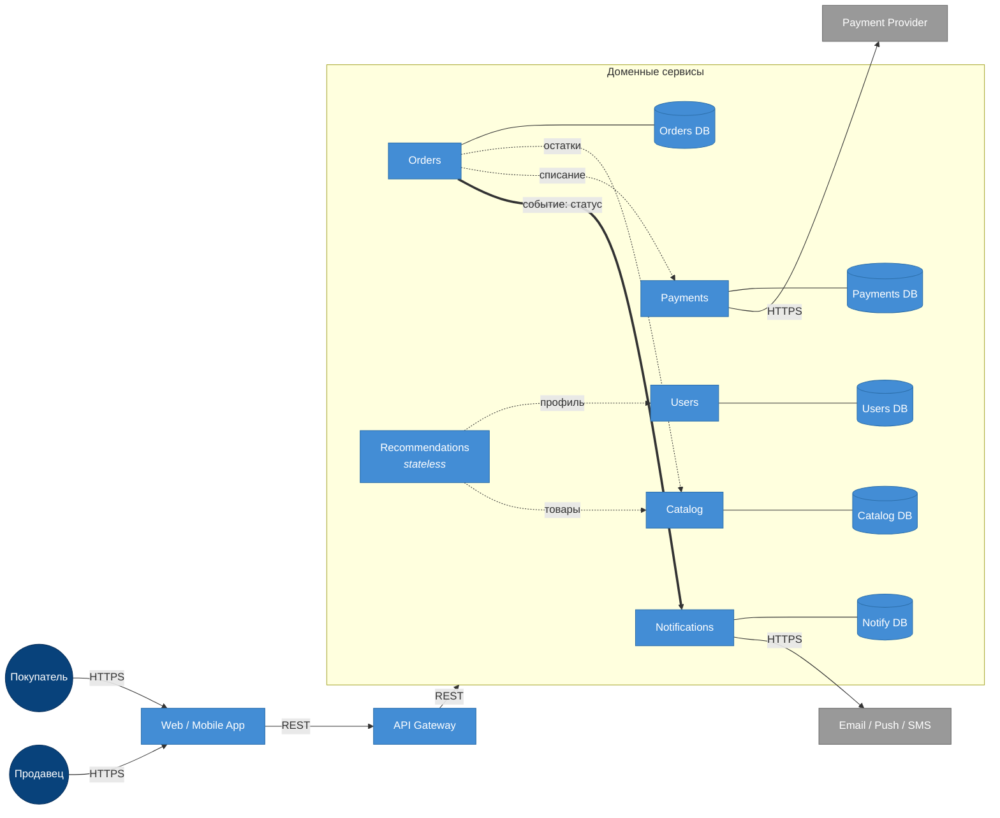

# ДЗ-1. Маркетплейс: C4 + сервис в Docker

## C4 Container

Сплошные тонкие стрелки — основной поток запроса и интеграции с внешними системами (HTTPS). Пунктирные с подписями — синхронные REST-вызовы между сервисами. Толстая стрелка `Orders → Notifications` — асинхронное событие (через шину/очередь).




## Домены и ответственности

| Домен | Ответственность |
|---|---|
| Identity & Auth | Регистрация, логин, пароли, сессии и токены |
| Users | Профили покупателей: имя, контакты, адреса доставки |
| Sellers | Профили продавцов, банковские реквизиты, настройки магазина |
| Catalog | Карточки товаров, категории, описания, медиа, цены |
| Cart | Корзина пользователя до оформления заказа |
| Orders | Оформление заказа и жизненный цикл статусов (`new → paid → shipped → delivered → cancelled`) |
| Payments | Приём платежей от покупателей, отмены и возвраты (refunds) |
| Payouts | Расчёт и перечисление денег продавцам |
| Recommendations | Сборка персональной ленты товаров для пользователя |
| Notifications | Шаблоны и доставка сообщений по Email / Push / SMS |

## Распределение доменов по сервисам

| Сервис | Какие домены | Логика группировки |
|---|---|---|
| Users | Identity & Auth + Users + Sellers | Все три крутятся вокруг сущности «пользователь». Продавец — тот же пользователь |
| Catalog | Catalog + Inventory | Каталог и остатки нужны вместе при любом запросе товара; владелец один — продавец. Inventory можно выделить позже, если резервы станут горячей транзакционной точкой |
| Orders | Cart + Orders | Корзина — пре-стадия заказа; данные постепенно превращаются в позиции заказа. В одном сервисе проще удержать согласованность «корзина → черновик → заказ» |
| Payments | Payments + Payouts | Оба про деньги, оба общаются с внешним PSP |
| Recommendations | Recommendations | Stateless-агрегатор: своих сущностей нет, читает Users + Catalog |
| Notifications | Notifications | Изолирован от бизнес-потока, чтобы тормоза внешних провайдеров не аффектили заказы |

API Gateway — общая точка входа клиента, проксирует запросы в нужный сервис; собственных доменных данных не хранит.

## Границы владения данными

| Сервис | Чем владеет (своя БД) | Откуда читает чужие данные |
|---|---|---|
| Users | токены/сессии, профили покупателей, профили продавцов | — |
| Catalog | товары, категории, цены, остатки, резервы | — |
| Recommendations | — (stateless) | Users (профиль), Catalog (товары) |
| Orders | корзины, заказы, позиции, статусы | Catalog (цена и остатки), Payments (статус платежа) — sync REST |
| Payments | платежные намерения, транзакции, возвраты, выплатные ведомости | внешний PSP — sync HTTPS |
| Notifications | история отправок, шаблоны сообщений | внешние провайдеры email/push/SMS — sync HTTPS |

Правила:

- У каждого сервиса **своя БД**. Между сервисами нет ни общих таблиц, ни общих схем — никаких разделяемых БД.
- К чужим данным сервис ходит **только через REST API** соответствующего владельца домена.
- При оформлении заказа Orders не копирует каталог: сохраняет `product_id` и цену на момент покупки (snapshot).

## Взаимодействия сервисов

| Откуда | Куда | Тип | Что передаёт |
|---|---|---|---|
| Web / Mobile | API Gateway | sync REST (HTTPS) | пользовательские запросы |
| API Gateway | любой доменный сервис | sync REST | проксирование |
| Recommendations | Users | sync REST | профиль пользователя |
| Recommendations | Catalog | sync REST | данные товаров для ленты |
| Orders | Catalog | sync REST | проверка/резерв остатков и цены |
| Orders | Payments | sync REST | списание средств |
| **Orders** | **Notifications** | **async event** | факт смены статуса заказа |
| Payments | Payment Provider | sync HTTPS | проведение платежа |
| Notifications | Email / Push / SMS | sync HTTPS | отправка сообщения |

Все «деловые» межсервисные вызовы — синхронный REST: при оформлении заказа нужны подтверждение остатка от Catalog и успех платежа от Payments прямо в рамках запроса. **Уведомления (Orders → Notifications)** вынесены в асинхронный канал (событие через шину/очередь): отправка email/push не должна блокировать оформление заказа и не должна откатывать его при сбое внешнего провайдера. Если Notifications упадёт, заказ всё равно создастся, а сообщение уйдёт позже (retry).

## Альтернативные варианты декомпозиции

Рассмотрены два существенно разных варианта.

### Вариант A. Модульный монолит

Все домены живут в одном приложении и одном деплойе. БД одна, разделение по схемам (`users`, `catalog`, `orders`, ...). Внешний API один.

```
┌─────────────────────────────────────────┐
│            Monolith (1 deploy)          │
│  users | catalog | orders | payments    │
│  recs  | notifications                  │
└─────────────────┬───────────────────────┘
                  │
            ┌─────▼─────┐
            │  Common DB │
            └────────────┘
```

### Вариант B. Микросервисы по доменам (текущий выбор)

Один сервис на доменную группу (Users, Catalog, Orders, Payments, Recommendations, Notifications), у каждого своя БД. API Gateway снаружи. Межсервисные вызовы — sync REST; уведомления — async event.

Варианты существенно отличаются:

## Trade-off'ы вариантов

### Вариант A. Монолит

**Плюсы:**

- Самая дешёвая разработка и эксплуатация на старте: один репозиторий, один пайплайн, один деплой.
- ACID-транзакции внутри одной БД: оформление заказа и списание остатка атомарны без саг.
- Нет сетевых вызовов между модулями → нет проблем с таймаутами и ретраями.

**Минусы:**

- Нельзя масштабировать домены независимо: каталог read-heavy и платежи транзакционные ходят по одной CPU/памяти.
- Платежи и персональные данные перемешаны с остальным кодом.
- Релизы блокируют команды друг у друга: любой багфикс в каталоге выкатывается через общий релиз.
- Радиус отказа максимальный: память течёт в одном модуле — падает всё приложение.

### Вариант B. Микросервисы по доменам

**Плюсы:**

- Домены масштабируются и деплоятся независимо: можно отдельно ускорить Catalog или Recommendations, не трогая Payments.
- Платежи и персональные данные живут в изолированных контурах со своими БД — проще закрыть требования безопасности.
- Радиус отказа ограничен: упал Notifications — заказы продолжают создаваться (особенно при async-канале).
- Контракты сервисов чёткие (REST + JSON), команды могут развиваться параллельно и на разных стеках при необходимости.

**Минусы:**

- Множество сетевых вызовов — нужны таймауты, ретраи.
- Нет общей транзакции между сервисами — согласованность держится сагами/идемпотентностью (`Orders → Payments → Inventory`).
- Дороже инфраструктура и DevOps: 6+ деплоев, 5+ БД, мониторинг, трассировка, CI/CD на каждый сервис.
- Усложняется локальная разработка: нужно поднимать compose с несколькими сервисами или мокать соседей.

## Обоснование финального выбора

**Выбран вариант B — микросервисы по бизнес-доменам.** Аргументация опирается на требования и ограничения кейса.

- **Соответствие структуре ТЗ.** Шесть функций задания (лента, каталог, пользователи, заказы, платежи, уведомления) уже отображаются в шесть сервисов один к одному. Декомпозиция вытекает из самого ТЗ.
- **Изоляция чувствительных доменов.** Кейс прямо требует «расчёта и учёта платежей» — это PCI-зона. В варианте B Payments и Users (с кредами/KYC) — отдельные контуры со своими БД, что упрощает требования к шифрованию, аудиту и регуляторике. В варианте A они смешаны с остальным кодом.
- **Разнородный нагрузочный профиль.** Лента и каталог — read-heavy, заказы и платежи — транзакционные, уведомления — bursty и зависят от внешних провайдеров. В монолите они масштабируются вместе и мешают друг другу; в варианте B каждое масштабируется по своему профилю.
- **Радиус отказа.** Ограничение из ТЗ — «отправку уведомлений о статусах» нельзя ставить в один цикл с оформлением заказа: внешний email/SMS-провайдер может тормозить или падать. В варианте B Notifications вынесены за event-канал, и отказ внешнего провайдера не валит заказ. В монолите такого изолировать нечем без переписывания.
- **Соответствие критерию ДЗ.** Задание явно требует показать, что «у каждого сервиса свои данные» и «общих БД между сервисами нет» — это ровно вариант B; вариант A это противоречит.

Монолит проигрывает по изоляции платежей, масштабированию доменов и радиусу отказа. Микросервисы по доменам дают нужный уровень разделения при разумной операционной стоимости.

## Запуск

Требования: Docker и Docker Compose.

```bash
cd hw-1
docker compose up --build -d
```

Проверка `/health`:

```bash
curl -i http://localhost:8080/health
```

Ожидаемый ответ:

```
HTTP/1.1 200 OK
content-type: application/json

{"status":"ok"}
```

Остановить:

```bash
docker compose down
```
