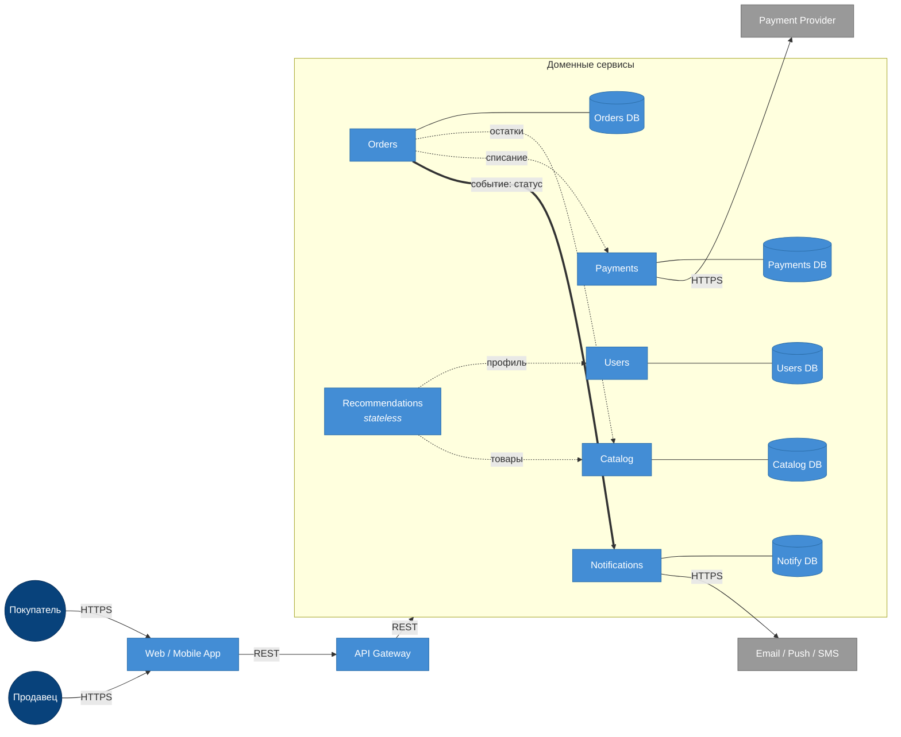

# ДЗ-1. Маркетплейс: C4 + сервис в Docker

## C4 Container

Сплошные тонкие стрелки — основной поток запроса и интеграции с внешними системами (HTTPS). Пунктирные с подписями — синхронные REST-вызовы между сервисами. Толстая стрелка `Orders → Notifications` — асинхронное событие (через шину/очередь).




## Домены и ответственности

Из ТЗ выделены шесть бизнес-доменов. Зона ответственности каждого:

| Домен | Ответственность |
|---|---|
| Users | Регистрация, авторизация, профили покупателей и продавцов |
| Catalog | Карточки товаров, категории, цены, остатки на складе |
| Recommendations | Персональная лента товаров для пользователя |
| Orders | Корзина, оформление и жизненный цикл заказа (статусы) |
| Payments | Приём платежей, выплаты продавцам, возвраты |
| Notifications | Email / Push / SMS о статусах заказов |

## Распределение доменов по сервисам

Принцип: **один домен — один сервис**. Каждый пункт ТЗ ложится в отдельный микросервис, у которого свой контракт API и своя БД. Web и API Gateway — инфраструктурные контейнеры и доменов не несут.

| Сервис | Домен | Почему выделен отдельно |
|---|---|---|
| Users | Users | Авторизация и персональные данные — самая чувствительная зона, изолируется в отдельном сервисе |
| Catalog | Catalog | Каталог read-heavy, профиль нагрузки отличается от транзакционных сервисов |
| Recommendations | Recommendations | Другой стек (фичи, ML, кеши), нагрузка на чтение, может масштабироваться независимо |
| Orders | Orders | Транзакционное ядро, оркестрирует другие сервисы, имеет свой жизненный цикл (статусы) |
| Payments | Payments | Требования к безопасности (PCI-зона), отдельный контур и отдельная команда |
| Notifications | Notifications | Зависит от внешних провайдеров с долгими/нестабильными ответами — не должен блокировать основной поток |

API Gateway — общая точка входа для клиента и проксирует запросы в нужный сервис; собственных доменных данных не хранит.

## Границы владения данными

| Сервис | Чем владеет (своя БД) | Откуда читает чужие данные |
|---|---|---|
| Users | пользователи, креды, профиль продавца | — |
| Catalog | товары, категории, цены, остатки | — |
| Recommendations | — (stateless) | Users (профиль), Catalog (товары) — sync REST |
| Orders | корзины, заказы, позиции, статусы | Catalog (цена и остатки) — sync REST |
| Payments | платежи, транзакции, выплаты | внешний PSP — sync HTTPS |
| Notifications | история отправок, шаблоны | внешние провайдеры email/push/SMS — sync HTTPS |

Правила:

- У каждого сервиса **своя БД**. Между сервисами нет ни общих таблиц, ни общих схем — никаких разделяемых БД.
- К чужим данным сервис ходит **только через REST API** соответствующего владельца домена.
- При оформлении заказа Orders не копирует каталог: сохраняет `product_id` и цену на момент покупки (snapshot).

## Взаимодействия сервисов

| Откуда | Куда | Тип | Что передаёт |
|---|---|---|---|
| Web / Mobile | API Gateway | sync REST (HTTPS) | пользовательские запросы |
| API Gateway | любой доменный сервис | sync REST | проксирование |
| Recommendations | Users | sync REST | профиль пользователя |
| Recommendations | Catalog | sync REST | данные товаров для ленты |
| Orders | Catalog | sync REST | проверка/резерв остатков и цены |
| Orders | Payments | sync REST | списание средств |
| **Orders** | **Notifications** | **async event** | факт смены статуса заказа |
| Payments | Payment Provider | sync HTTPS | проведение платежа |
| Notifications | Email / Push / SMS | sync HTTPS | отправка сообщения |

Все «деловые» межсервисные вызовы — синхронный REST: при оформлении заказа нужны подтверждение остатка от Catalog и успех платежа от Payments прямо в рамках запроса. **Уведомления (Orders → Notifications)** вынесены в асинхронный канал (событие через шину/очередь): отправка email/push не должна блокировать оформление заказа и не должна откатывать его при сбое внешнего провайдера. Если Notifications упадёт, заказ всё равно создастся, а сообщение уйдёт позже (retry).

## Запуск

Требования: Docker и Docker Compose.

```bash
cd hw-1
docker compose up --build -d
```

Проверка `/health`:

```bash
curl -i http://localhost:8080/health
```

Ожидаемый ответ:

```
HTTP/1.1 200 OK
content-type: application/json

{"status":"ok"}
```

Остановить:

```bash
docker compose down
```
