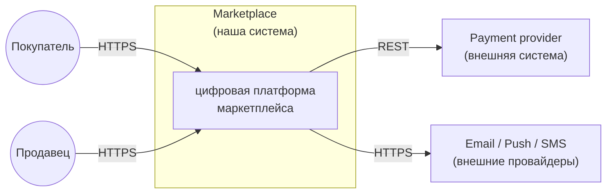
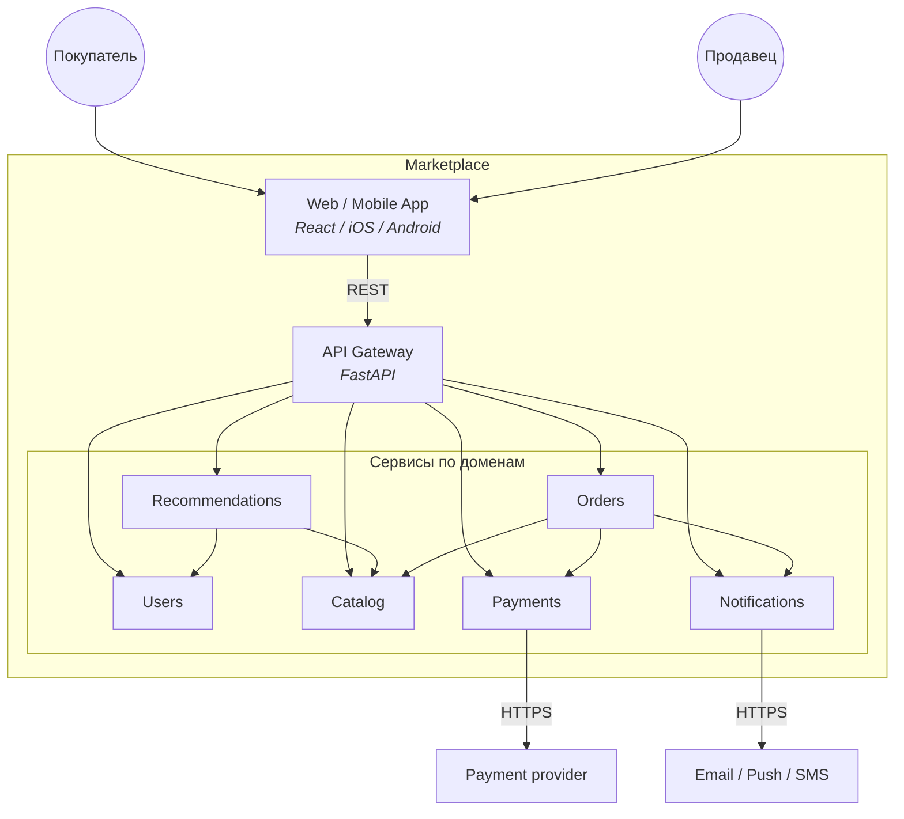
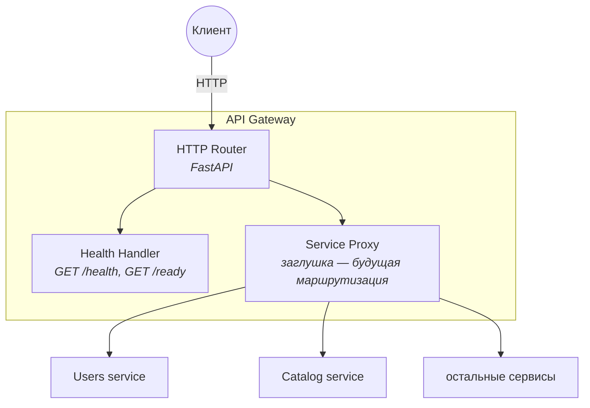
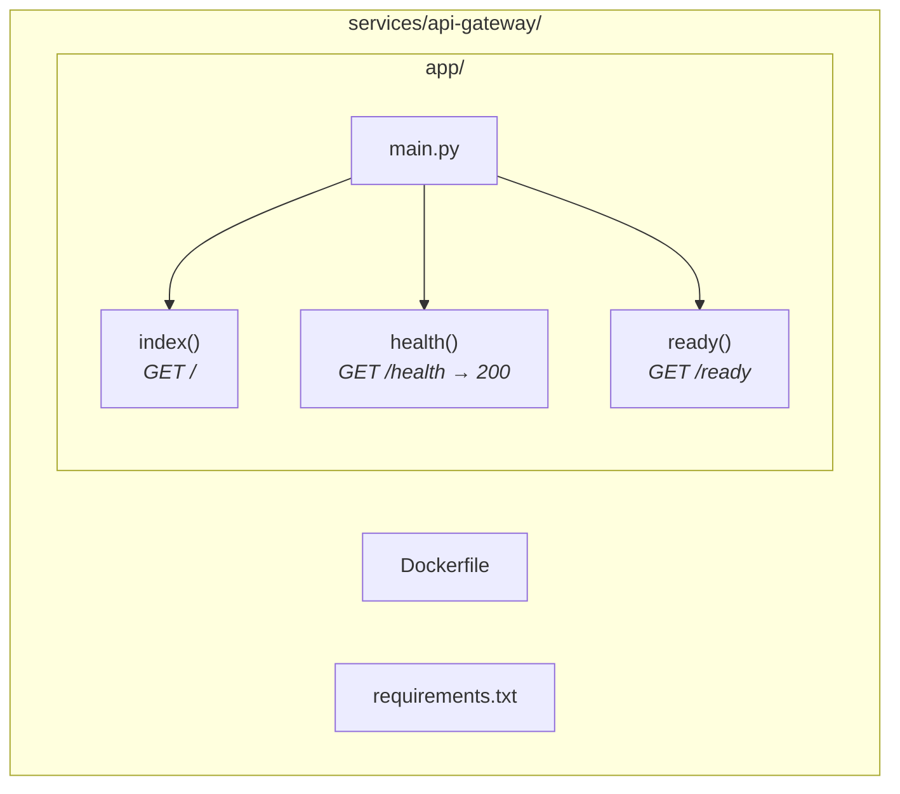

# ДЗ-1. Маркетплейс: архитектура (C4) + сервис в Docker

Цель работы — спроектировать архитектуру цифрового маркетплейса, описать её на уровне C4 и продемонстрировать работоспособность одного сервиса в Docker. Бизнес-логика по условию задания не реализуется.

Функции системы, заданные ТЗ:

| Функция | Кратко |
|---|---|
| Персонализированная лента | главная под пользователя |
| Каталог | продавцы ведут товары и остатки |
| Пользователи | покупатели и продавцы, авторизация, профиль |
| Заказы | корзина, оформление, статусы |
| Платежи | списания, выплаты продавцам, возвраты |
| Уведомления | письма / пуш / SMS о статусах заказа |

---

## 1. Архитектура: C4

Модель C4 описывает систему на четырёх уровнях детализации: **Context → Container → Component → Code**. Ниже представлены все четыре уровня.

### 1.1 Level 1: System Context

Внешний взгляд: пользователи и внешние системы, с которыми взаимодействует маркетплейс.



Формальная C4-PlantUML версия: [`diagrams/c4-context.puml`](diagrams/c4-context.puml).

### 1.2 Level 2: Container

Из каких контейнеров (сервисов и приложений) состоит маркетплейс. Это основная диаграмма для ДЗ.



Все межсервисные стрелки — синхронный REST. Gateway — единая точка входа с клиента. Recommendations обращается в Catalog и Users, чтобы собрать персональную ленту. Orders при оформлении проверяет остаток в Catalog, дёргает Payments на списание и Notifications на отправку уведомления.

Формальная C4-PlantUML версия: [`diagrams/c4-container.puml`](diagrams/c4-container.puml).

### 1.3 Level 3: Component (внутри API Gateway)

Компоненты внутри сервиса API Gateway — того, что реально поднимается в Docker.



В рамках ДЗ реализованы только `HTTP Router` и `Health Handler`. `Service Proxy` показан как точка расширения для будущей маршрутизации в downstream-сервисы.

### 1.4 Level 4: Code

Карта файлов и функций реализованного сервиса.



Исходник: [`services/api-gateway/app/main.py`](services/api-gateway/app/main.py).

---

## 2. Сервис в Docker

В качестве демонстрационного сервиса поднят **API Gateway** на FastAPI — он представлен на диаграмме Container как точка входа в систему. Бизнес-логика отсутствует, реализованы только инфраструктурные эндпоинты.

| Метод | Путь | Назначение |
|---|---|---|
| GET | `/` | служебная информация о сервисе |
| GET | `/health` | возвращает `200 OK` и JSON `{"status":"ok"}` — требование ДЗ |
| GET | `/ready` | готовность принимать трафик |
| GET | `/docs` | Swagger UI (автогенерируется FastAPI) |

### Запуск

Из папки `hw-1`:

```bash
docker compose up --build -d
curl -i http://localhost:8080/health
```

Ожидаемый ответ:

```
HTTP/1.1 200 OK
content-type: application/json

{"status":"ok","service":"api-gateway","version":"0.1.0"}
```

Остановить:

```bash
docker compose down
```

Запуск без Docker (для разработки):

```bash
cd services/api-gateway
python -m venv .venv
source .venv/bin/activate   # Windows: .venv\Scripts\activate
pip install -r requirements.txt
uvicorn app.main:app --host 0.0.0.0 --port 8080
```

---

## 3. Домены и границы владения данными

Каждый пункт ТЗ ложится на отдельный bounded context.

| Сервис | Зона ответственности | Данные (владеет) |
|---|---|---|
| API Gateway | единая точка входа, маршрутизация | без своей БД |
| Users | пользователи, авторизация, профиль | пользователи, сессии, профиль продавца |
| Catalog | каталог товаров | товары, категории, цены, остатки |
| Recommendations | персональная лента | история просмотров, данные для ленты |
| Orders | корзина, заказы, статусы | корзины, заказы, позиции |
| Payments | платежи и выплаты | платежи, транзакции, выплаты |
| Notifications | уведомления о статусах | отправки, шаблоны |

**Правило владения данными:**

- У каждого сервиса **своя база**. Общих БД между сервисами нет.
- Доступ к данным чужого домена — только через **HTTP API** этого сервиса.
- Никаких join'ов между БД разных сервисов.

Такая декомпозиция даёт **высокий cohesion внутри сервиса** (одна предметная область и её данные в одном месте) и **низкий coupling между сервисами** (контракт API, без общих таблиц).

### Кто кого вызывает (всё sync, REST)

| Откуда | Куда | Зачем |
|---|---|---|
| Gateway | остальные сервисы | проксирование запросов из клиентского приложения |
| Recommendations | Catalog, Users | собрать ленту под пользователя |
| Orders | Catalog | проверить и зарезервировать остаток |
| Orders | Payments | списать деньги |
| Orders | Notifications | уведомить о смене статуса |
| Payments | внешний PSP | сам платёж |
| Notifications | внешние провайдеры | письмо / пуш / SMS |

---

## 4. Альтернативные варианты декомпозиции

Рассмотрено три существенно отличающихся варианта.

### Вариант A. Монолит

Все модули (Users, Catalog, Recommendations, Orders, Payments, Notifications) собраны в один деплой; общая база с разными схемами.

### Вариант B. Микросервисы по бизнес-доменам

Один сервис на каждый пункт ТЗ + API Gateway снаружи. У каждого сервиса своя БД, между сервисами — синхронный REST.

### Вариант C. Read/write-разделение (CQRS-lite)

В дополнение к доменным сервисам выделяются отдельные read-сервисы (отдельный контур ленты и поиска), которые получают обновления от write-сервисов.

Варианты заметно отличаются по числу контуров, владению данными и стилю взаимодействия.

---

## 5. Trade-off'ы вариантов

| Критерий | A. Монолит | B. По доменам | C. CQRS |
|---|---|---|---|
| Стоимость старта | низкая | средняя | высокая |
| Независимое масштабирование | нет | да | да++ |
| Изоляция платежей и персональных данных | нет | да | да |
| Согласованность данных | через ACID-транзакции | требует ручных сценариев | везде eventual |
| Сложность эксплуатации | низкая | средняя | высокая |
| Подходит read-heavy | плохо | хорошо | отлично |

**Вариант A: монолит**
- Плюсы: проще разрабатывать и деплоить; ACID-транзакции внутри одной БД; нет сетевых отказов между модулями.
- Минусы: нагрузка масштабируется только целиком; платежная зона и персональные данные перемешаны с остальным кодом; релизы блокируют команды друг у друга.

**Вариант B: микросервисы по доменам**
- Плюсы: домены масштабируются и деплоятся независимо; платежи и персональные данные изолированы в своих сервисах; контракты сервисов чёткие; команды развиваются параллельно.
- Минусы: много сетевых вызовов; согласованность между сервисами нужно держать вручную (нет общей транзакции); требуется наблюдаемость и обработка ошибок сети.

**Вариант C: CQRS-lite**
- Плюсы: read-контур масштабируется отдельно и оптимально подходит для ленты и поиска; чтения не мешают записи.
- Минусы: больше контуров и сервисов; eventual consistency бьёт по UX (после правки товара лента обновляется не сразу); дублирование моделей; избыточно на старте.

---

## 6. Обоснование финального выбора

**Выбран вариант B — микросервисы по бизнес-доменам.**

Аргументация опирается на требования кейса и его ограничения:

- **Соответствует структуре ТЗ.** Шесть функций задания (лента, каталог, пользователи, заказы, платежи, уведомления) напрямую отображаются в шесть сервисов. Один пункт ТЗ — один владелец данных, одна зона ответственности.
- **Изолирует чувствительные данные.** ТЗ требует расчёта и учёта платежей; в варианте B платежи и персональные данные пользователей живут в отдельных сервисах со своими БД, что упрощает требования к безопасности и регуляторике.
- **Поддерживает независимое развитие.** Каталог, лента, заказы и платежи могут разрабатываться и масштабироваться независимо — это соответствует разнородной нагрузке (лента и каталог read-heavy, заказы и платежи — транзакционные).
- **Не избыточен для старта.** Вариант C даёт выигрыш только при действительно высокой нагрузке на чтение и сильно увеличивает число контуров; для учебного маркетплейса это преждевременная оптимизация. Read-разделение можно добавить эволюционно внутри варианта B (выделить read-модель в Recommendations или Catalog).
- **Не теряет границы доменов, как монолит.** Вариант A экономит инфраструктуру, но размывает зоны ответственности и оставляет платежи в одном процессе с остальной системой — это противоречит критерию «у каждого сервиса свои данные».

---

## Структура папки

```
hw-1/
├── README.md
├── docker-compose.yml
├── diagrams/
│   ├── c4-context.puml       # Level 1 в C4-PlantUML
│   └── c4-container.puml     # Level 2 в C4-PlantUML
└── services/
    └── api-gateway/
        ├── Dockerfile
        ├── requirements.txt
        └── app/
            └── main.py
```
