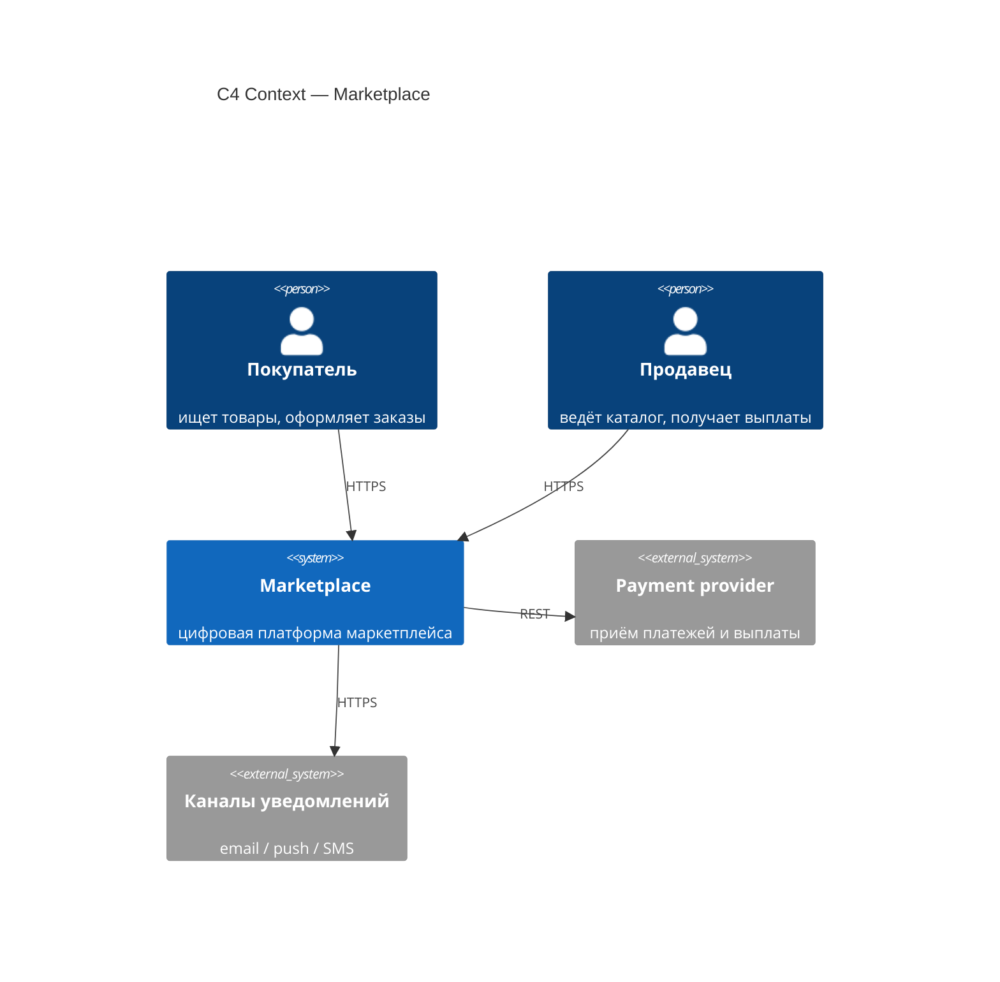
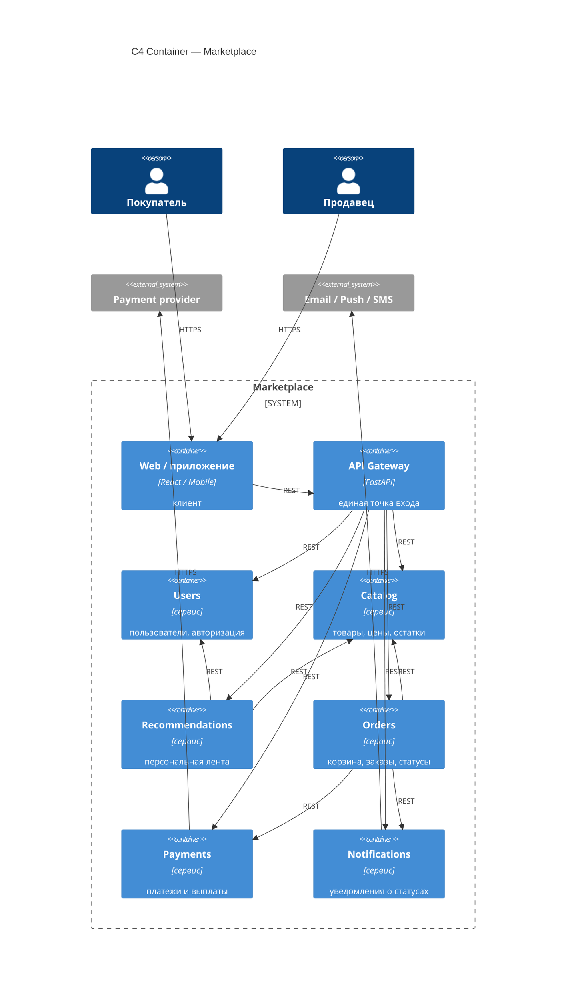

# ДЗ-1. Маркетплейс: архитектура (C4) + сервис в Docker

Задание: продумать архитектуру маркетплейса, нарисовать **C4 уровень Container**, поднять **один** сервис в Docker с **`GET /health` → 200 OK**. Логику бизнеса не пишем — только описание и заглушка сервиса.

## Что должна уметь система (из ТЗ)

| Функция | Кратко |
|---|-----|
| Персонализированная лента | главная под пользователя |
| Каталог | продавцы ведут товары и остатки |
| Пользователи | покупатели и продавцы, авторизация, профиль |
| Заказы | корзина, оформление, статусы |
| Платежи и учёт | списание, выплаты продавцам, возвраты |
| Уведомления | письма/пуши/SMS про заказ |

## Домены (bounded context)

| Домен | За что отвечает |
|-------|----------------|
| Users | пользователи (покупатели и продавцы), вход, профиль |
| Catalog | товары, категории, цены, остатки |
| Recommendations | персональная лента товаров |
| Orders | корзина, оформление, статусы заказа |
| Payments | списания, выплаты продавцам, возвраты |
| Notifications | уведомления о статусах заказа |

Правило: **у каждого сервиса своя база**, общих БД нет. Доступ к чужим данным только через **HTTP API** (или gRPC) другого сервиса.

Так мы получаем **высокое сцепление (cohesion) внутри сервиса** — в одном месте живёт связанная по смыслу логика и данные одного домена. **Связанность между сервисами (coupling) держим низкой**: сервис не лезет в чужую БД, знает только контракт чужого API, без общих таблиц.

## Варианты разнесения системы

**A. Один большой монолит** — все модули в одном деплое, одна БД (или схемы в одной).

- Плюсы: проще разрабатывать и деплоить в начале, проще транзакции внутри.
- Минусы: один репозиторий нагрузки на всё приложение; платежная зона смешивается с остальным кодом.

**B. Несколько сервисов по доменам** — ниже взял это (Gateway + отдельные сервисы под таблицу доменов).

- Плюсы: можно масштабировать и выкладывать части отдельно; платежи и персональные данные проще изолировать.
- Минусы: много сетевых вызовов между сервисами; без общей БД сложнее согласовывать состояние — нужно продумывать сценарии вручную.

**C. Отдельно read-сервисы для ленты и поиска** — отдельный контур только на чтение.

- Плюсы: удобно при очень высокой нагрузке на просмотр.
- Минусы: лишние контуры для учебного задания; задержка между записью в каталог и отображением в ленте.

**Итог:** **вариант B** — отдельный сервис на каждый домен из таблицы. Везде для простоты считаю **синхронные REST-вызовы** между сервисами (без брокера сообщений).

## C4 Context



PlantUML-версия: [`diagrams/c4-context.puml`](diagrams/c4-context.puml).

## C4 Container (основная диаграмма для ДЗ)



Все стрелки — синхронные REST-вызовы. Gateway — единственная точка входа с клиента. Recommendations ходит за товарами в Catalog и за данными пользователя в Users, чтобы собрать ленту. Orders при оформлении проверяет остаток в Catalog, дёргает Payments на списание и Notifications на письмо/пуш. Очередей и шины нет — это упрощение.

PlantUML-версия: [`diagrams/c4-container.puml`](diagrams/c4-container.puml).

## Домены → сервисы и базы своих доменов

| Сервис | Домен | Данные (владеет) |
|--------|-------|-------------------|
| API Gateway | — | без своей БД |
| Users | Users | пользователи, профиль, авторизация |
| Catalog | Catalog | товары, категории, цены, остатки |
| Recommendations | Recommendations | история просмотров, данные для ленты |
| Orders | Orders | корзина, заказы, статусы |
| Payments | Payments | платежи, транзакции, выплаты |
| Notifications | Notifications | отправки, шаблоны |

Связи (всё sync):

| Откуда | Куда | Зачем |
|--------|------|-------|
| Gateway | остальные сервисы | запросы из приложения |
| Recommendations | Catalog, Users | собрать ленту под пользователя |
| Orders | Catalog | проверить и зарезервировать остаток |
| Orders | Payments | списать деньги |
| Orders | Notifications | уведомить о смене статуса |
| Payments | внешний PSP | сам платёж |
| Notifications | провайдеры | письмо / пуш / SMS |

## Сервис в Docker

Поднят **API Gateway** на FastAPI (`GET /health` → 200), остальное заглушка. Код: [`services/api-gateway/`](services/api-gateway/).

## Как запустить

Из папки `hw-1`:

```bash
docker compose up --build -d
curl -i http://localhost:8080/health
```

Остановить: `docker compose down`.

Локально без Docker:

```bash
cd services/api-gateway
python -m venv .venv
source .venv/bin/activate   # Windows: .venv\Scripts\activate
pip install -r requirements.txt
uvicorn app.main:app --host 0.0.0.0 --port 8080
```

## Структура папки

```
hw-1/
├── README.md
├── docker-compose.yml
├── diagrams/
│   ├── c4-context.puml
│   └── c4-container.puml
└── services/api-gateway/
    ├── Dockerfile
    ├── requirements.txt
    └── app/main.py
```
