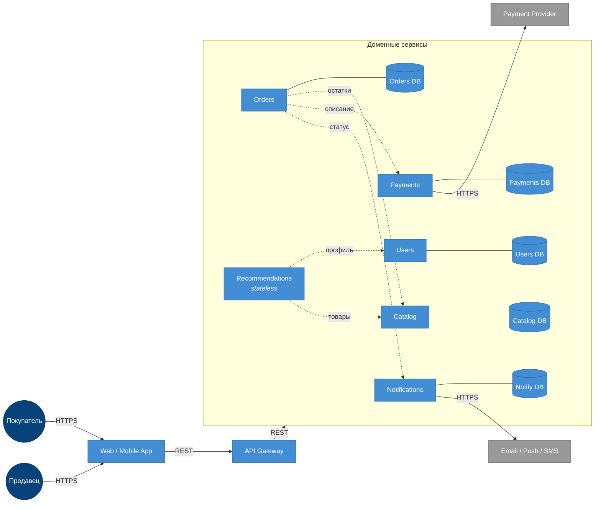

# ДЗ-1. Маркетплейс: C4 + сервис в Docker

## Структура

```
hw-1/
├── README.md
├── docker-compose.yml
├── diagrams/
│   └── container.puml       # C4 Container диаграмма (PlantUML)
└── api-gateway/             # сервис, поднимаемый в Docker
    ├── Dockerfile
    ├── requirements.txt
    └── app/
        └── main.py
```

## C4 Container

Исходник: [`diagrams/container.puml`](diagrams/container.puml).

Сплошные стрелки — основной поток запроса пользователя (`клиент → Web → Gateway → доменные сервисы`) и интеграции с внешними системами. Пунктирные с подписями — синхронные REST-вызовы между доменными сервисами. Цветовая палитра соответствует C4: actors тёмно-синие, контейнеры и БД — синие, внешние системы — серые.



### Контейнеры и владение данными

| Контейнер | Ответственность | Своя БД |
|---|---|---|
| Web / Mobile App | Клиентское приложение | — |
| API Gateway | Единая точка входа, маршрутизация | — |
| Users | Пользователи, авторизация, профиль | Users DB |
| Catalog | Товары, категории, остатки | Catalog DB |
| Recommendations | Персональная лента | — (читает Users + Catalog) |
| Orders | Корзина, заказы, статусы | Orders DB |
| Payments | Платежи и выплаты | Payments DB |
| Notifications | Уведомления о статусах | Notify DB |

Каждый доменный сервис владеет своей БД, общих баз между сервисами нет — доступ к чужим данным только через REST API соответствующего сервиса. Это даёт независимое масштабирование, изоляцию платежей и персональных данных и прямое соответствие пунктам ТЗ (лента → Recommendations, каталог → Catalog, пользователи → Users, заказы → Orders, платежи → Payments, уведомления → Notifications).

Recommendations — единственный сервис без собственной БД: у него нет своих доменных сущностей, он на каждый запрос собирает ленту, дёргая Users (профиль) и Catalog (товары). Логи взаимодействий и кеши предсказаний (Redis / фича-стор) можно ввести эволюционно позже, когда понадобится более тяжёлая персонализация.

В Docker в рамках ДЗ поднимается один сервис — `api-gateway`, как точка входа в систему.

## Запуск

Требования: Docker и Docker Compose.

```bash
cd hw-1
docker compose up --build -d
```

Проверка `/health`:

```bash
curl -i http://localhost:8080/health
```

Ожидаемый ответ:

```
HTTP/1.1 200 OK
content-type: application/json

{"status":"ok"}
```

Остановить:

```bash
docker compose down
```
