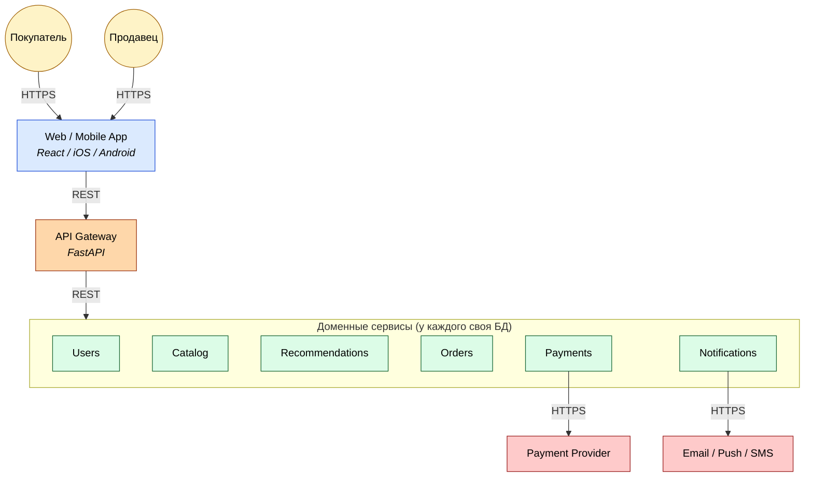
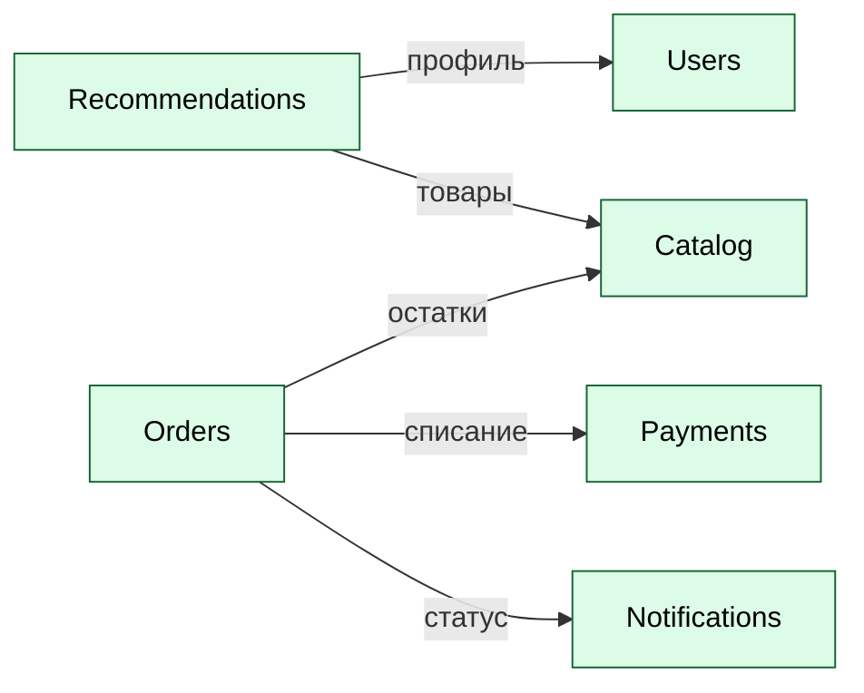

# ДЗ-1. Маркетплейс: C4 + сервис в Docker

Архитектура цифрового маркетплейса на уровне C4 Container и один работающий сервис (`api-gateway`), поднимаемый в Docker. По условию задания бизнес-логика не реализуется.

## Структура

```
hw-1/
├── README.md
├── docker-compose.yml
├── diagrams/
│   └── container.puml       # C4 Container диаграмма (PlantUML)
└── api-gateway/             # сервис, поднимаемый в Docker
    ├── Dockerfile
    ├── requirements.txt
    └── app/
        └── main.py
```

## C4 Container

Исходник: [`diagrams/container.puml`](diagrams/container.puml).

### Общий вид: запросы пользователя

Основной поток — сплошные стрелки сверху вниз: клиент идёт в Web, Web в Gateway, Gateway в доменные сервисы. Внешние интеграции справа.



### Межсервисные вызовы

Только взаимодействия между доменными сервисами — без актёров и web. Все стрелки — синхронный REST.



### Контейнеры и владение данными

| Контейнер | Технология | Ответственность | Своя БД |
|---|---|---|---|
| Web / Mobile App | React / iOS / Android | Клиент | — |
| API Gateway | Python, FastAPI | Единая точка входа, маршрутизация | — |
| Users | — | Пользователи, авторизация, профиль | Users DB |
| Catalog | — | Товары, категории, остатки | Catalog DB |
| Recommendations | — | Персональная лента | Recs DB |
| Orders | — | Корзина, заказы, статусы | Orders DB |
| Payments | — | Платежи и выплаты | Payments DB |
| Notifications | — | Уведомления о статусах | Notify DB |

Каждый доменный сервис владеет своей БД, общих баз между сервисами нет — доступ к чужим данным только через REST API соответствующего сервиса. Это даёт независимое масштабирование, изоляцию платежей и персональных данных и прямое соответствие пунктам ТЗ (лента → Recommendations, каталог → Catalog, пользователи → Users, заказы → Orders, платежи → Payments, уведомления → Notifications).

В Docker в рамках ДЗ поднимается один сервис — `api-gateway`, как точка входа в систему.

## Запуск

Требования: Docker и Docker Compose.

```bash
cd hw-1
docker compose up --build -d
```

Проверка `/health`:

```bash
curl -i http://localhost:8080/health
```

Ожидаемый ответ:

```
HTTP/1.1 200 OK
content-type: application/json

{"status":"ok"}
```

Остановить:

```bash
docker compose down
```
