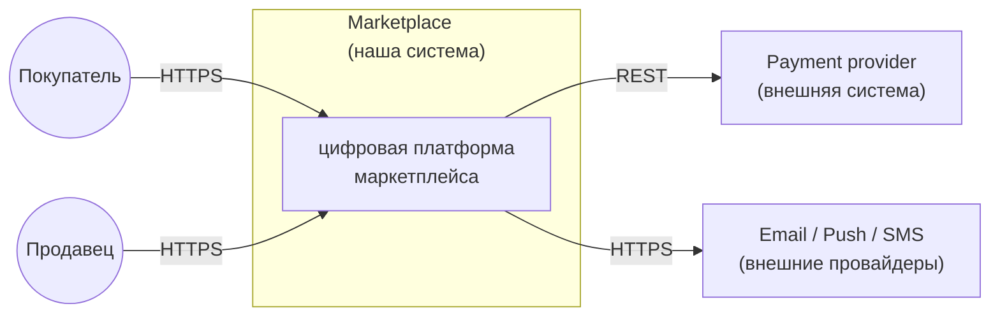
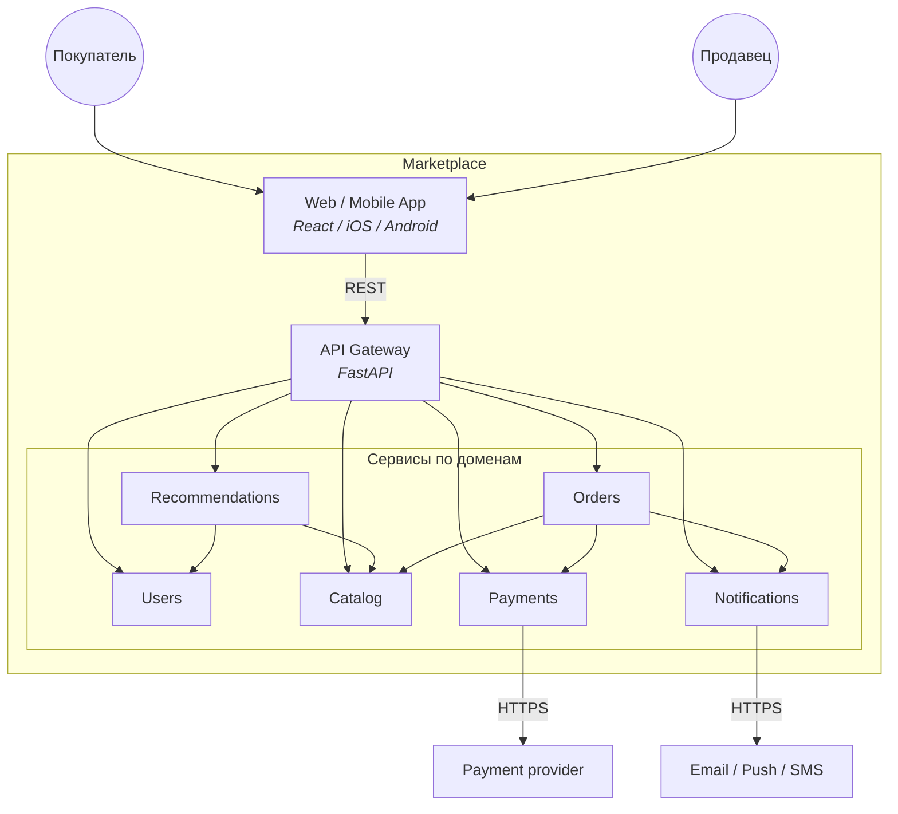
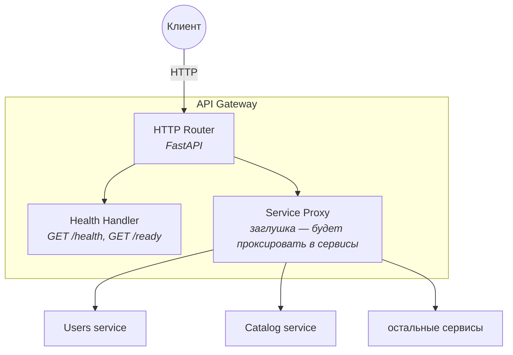
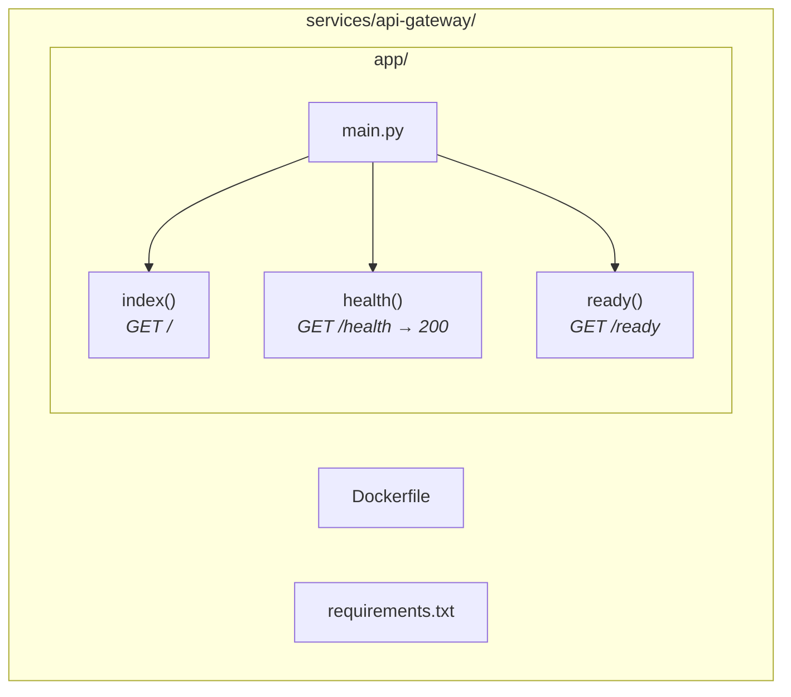

# ДЗ-1. Маркетплейс: архитектура (C4) + сервис в Docker

В этом README пишу решение **по шагам, как делал**: разобрал ТЗ → выделил домены → выбрал способ разбиения системы → нарисовал C4 на четырёх уровнях → поднял один сервис в Docker.

---

## Шаг 1. Разбираю задание

Из ТЗ маркетплейс должен поддерживать:

| Функция | Кратко |
|---|---|
| Персонализированная лента | главная под пользователя |
| Каталог | продавцы ведут товары и остатки |
| Пользователи | покупатели и продавцы, авторизация, профиль |
| Заказы | корзина, оформление, статусы |
| Платежи | списания, выплаты продавцам, возвраты |
| Уведомления | письма/пуши/SMS о статусах заказа |

Дополнительно из ТЗ: бизнес-логику писать **не нужно**; нужен **один любой сервис в Docker** с **`GET /health` → 200 OK**.

---

## Шаг 2. Выделяю домены (bounded contexts)

Каждый пункт ТЗ ложится на свой домен. У каждого домена своя ответственность и свои данные.

| Домен | За что отвечает |
|-------|----------------|
| Users | пользователи (покупатели и продавцы), вход, профиль |
| Catalog | товары, категории, цены, остатки |
| Recommendations | персональная лента товаров |
| Orders | корзина, оформление, статусы заказа |
| Payments | списания, выплаты продавцам, возвраты |
| Notifications | уведомления о статусах заказа |

Правило: **у каждого сервиса своя база данных**, общих БД между сервисами нет. К чужим данным — только через **HTTP API** другого сервиса.

Это даёт:

- **высокий cohesion внутри сервиса** — одна предметная область и её данные в одном месте;
- **низкий coupling между сервисами** — сервис знает только контракт чужого API, не лезет в чужие таблицы.

---

## Шаг 3. Выбираю способ разбиения системы

Рассмотрел три варианта.

**A. Монолит.** Всё в одном деплое, общая БД.

- Плюсы: проще разрабатывать и деплоить в начале, проще транзакции внутри.
- Минусы: нагрузка масштабируется только целиком; платежи перемешаны с остальным кодом.

**B. Микросервисы по доменам** — по одному сервису на пункт ТЗ.

- Плюсы: каждый домен можно масштабировать и выкатывать отдельно; платежи и персональные данные изолированы.
- Минусы: много межсервисных вызовов; согласованность данных нужно держать вручную (нет общей транзакции).

**C. Отдельный read-контур** — отдельные сервисы только под чтение (лента, поиск).

- Плюсы: хорошо при очень высокой нагрузке на чтение.
- Минусы: лишние сервисы для учебной задачи; задержка между записью и появлением в ленте.

**Выбрал вариант B.** Шесть функций из ТЗ напрямую отображаются в шесть сервисов; персональные данные и платежи в своих сервисах; начинать проще, чем с варианта C. Все вызовы между сервисами для простоты делаю **синхронным REST** (без брокера сообщений).

---

## Шаг 4. Описываю архитектуру через C4

Модель C4 даёт четыре уровня: **Context → Container → Component → Code**. Прохожу все четыре.

### 4.1 Level 1: System Context

Кто пользуется системой и с какими внешними сервисами она общается.



Формальная C4-PlantUML версия: [`diagrams/c4-context.puml`](diagrams/c4-context.puml).

### 4.2 Level 2: Container

Из каких контейнеров (сервисов и приложений) состоит система. Это основная диаграмма для ДЗ.



Все стрелки между сервисами — синхронный REST. Gateway — единая точка входа с клиента. Recommendations ходит в Catalog и Users, чтобы собрать персональную ленту. Orders при оформлении проверяет остаток в Catalog, дёргает Payments на списание и Notifications на отправку уведомления.

Формальная C4-PlantUML версия: [`diagrams/c4-container.puml`](diagrams/c4-container.puml).

#### Что владеет какими данными

| Сервис | Данные |
|---|---|
| API Gateway | без своей БД |
| Users | пользователи, профиль, авторизация |
| Catalog | товары, категории, цены, остатки |
| Recommendations | история просмотров, данные для ленты |
| Orders | корзина, заказы, статусы |
| Payments | платежи, транзакции, выплаты |
| Notifications | отправки, шаблоны |

#### Кто кого и зачем вызывает (всё sync)

| Откуда | Куда | Зачем |
|---|---|---|
| Gateway | остальные сервисы | запросы из приложения |
| Recommendations | Catalog, Users | собрать ленту |
| Orders | Catalog | проверить и зарезервировать остаток |
| Orders | Payments | списать деньги |
| Orders | Notifications | уведомить о смене статуса |
| Payments | внешний PSP | сам платёж |
| Notifications | провайдеры | письмо / пуш / SMS |

### 4.3 Level 3: Component (внутри API Gateway)

Из чего состоит сам **API Gateway** — единственный сервис, который реально поднят в Docker. Бизнес-логики нет, но архитектурно компоненты выглядят так.



На этом этапе ДЗ реально реализованы только `Router` и `Health Handler`; `Service Proxy` — заглушка для будущей бизнес-логики.

### 4.4 Level 4: Code

Самый низкий уровень C4 — код реализованного сервиса (`api-gateway`). По C4 этот уровень рисуется редко; здесь это просто карта файлов и функций.



Содержимое: [`services/api-gateway/app/main.py`](services/api-gateway/app/main.py).

---

## Шаг 5. Поднимаю один сервис в Docker

По ТЗ нужно поднять любой один сервис с health-check. Я взял **API Gateway** — он на диаграмме Container и является точкой входа, поэтому на нём учебно показательнее всего.

Что есть в сервисе:

| Метод | Путь | Что делает |
|---|---|---|
| GET | `/` | служебная инфо о сервисе |
| GET | `/health` | возвращает `200 OK` и JSON `{"status":"ok"}` — требование ДЗ |
| GET | `/ready` | готовность принимать трафик |
| GET | `/docs` | Swagger UI (автогенерируется FastAPI) |

Конфигурация Docker:

- [`services/api-gateway/Dockerfile`](services/api-gateway/Dockerfile) — образ на `python:3.12-slim`, ставит зависимости, запускает `uvicorn`.
- [`docker-compose.yml`](docker-compose.yml) — пробрасывает порт `8080`.

---

## Шаг 6. Запуск проекта

Из папки `hw-1`:

```bash
docker compose up --build -d
curl -i http://localhost:8080/health
```

Ожидаемый ответ:

```
HTTP/1.1 200 OK
content-type: application/json

{"status":"ok","service":"api-gateway","version":"0.1.0"}
```

Остановить:

```bash
docker compose down
```

Локально без Docker:

```bash
cd services/api-gateway
python -m venv .venv
source .venv/bin/activate   # Windows: .venv\Scripts\activate
pip install -r requirements.txt
uvicorn app.main:app --host 0.0.0.0 --port 8080
```

---

## Структура папки

```
hw-1/
├── README.md
├── docker-compose.yml
├── diagrams/
│   ├── c4-context.puml       # Level 1 в C4-PlantUML
│   └── c4-container.puml     # Level 2 в C4-PlantUML
└── services/
    └── api-gateway/
        ├── Dockerfile
        ├── requirements.txt
        └── app/
            └── main.py
```
